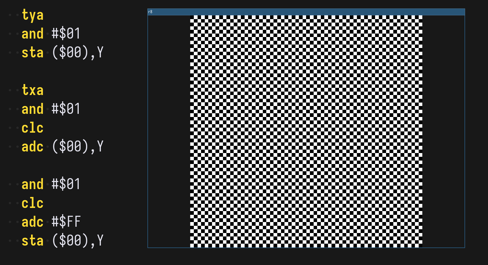

# r8

Fantasy console based on 6502 and rendered using Raylib.



Mostly inspired by things like [Uxn](https://100r.co/site/uxn.html) but uses [6502](https://en.wikipedia.org/wiki/MOS_Technology_6502) as the underlying base VM. The environment your ROMs are running in is completely made up and doesn't correspond to any real hardware that ever existed (hense the "fantasy" part).

## Quick Start

```console
$ cc -o nob nob.c
$ ./nob
$ ./build/r8 ./build/examples/checker.rom
```

We have only tested on Linux so far. But [Windows](./tasks/20260801-113453/TASK.md) and [MacOS](./tasks/20260801-113457/TASK.md) supports are coming eventually.

## Controls

| Key               | Desciption             |
|-------------------|------------------------|
| <kbd>Ctrl+R</kbd> | Reload the current ROM |

You can Drag&Drop ROM files onto the window.

## ROM specs

ROMs are just binary files consisted of 6502 machine code instructions. Produce them with whatever assembler your heart desire (even manually if you feel spicy). We supply some binaries of [vasm](./vasm6502_oldstyle/) that we stole from [http://www.compilers.de/vasm.html](http://www.compilers.de/vasm.html). You can use them as a starting point. Check out [examples](./examples/) for some ROM assemblies.

TBD

## Special Thanks

Special Thanks goes to codecat69, sushi, and many other chatters in the Twitch chat who were patient with me and provided invaluable help as I was impatiently familiarizing myself with the wonders of 6502 raw assembly programming ^^"
