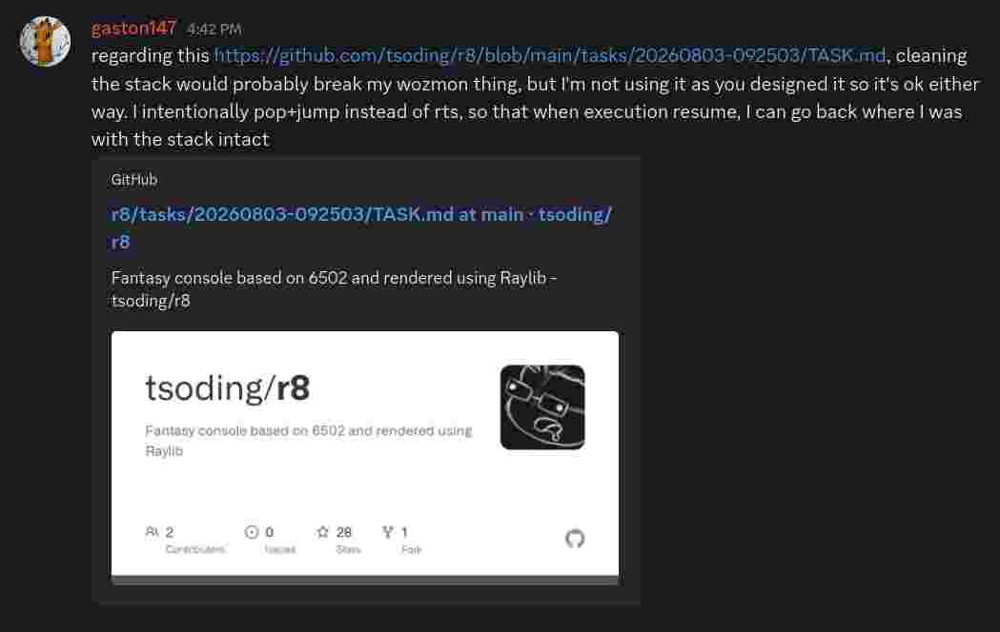

# Maybe r8 should clean up the stack when the ROM jumps to `$6969`

- STATUS: OPEN
- PRIORITY: 100

`pc == $6969` indicates that the ROM is done and wants to hand over control flow to r8. Before calling a vector r8 pushed `$6969` on the stack so it's easier for the ROM to just `rts` from the vector. But in the earlier versions we didn't do that and the ROM was expected to `jmp $6969`. Maybe to accomodate this use case we could make r8 just clean up the stack after the ROM jumps to `$6969` regardless of how it did that. Because if ROM keeps doing `jmp $6969` instead of expected `rts` the stack eventually is going to overflow.

---

Retaining stack between vector calls could be used to resume executions:

https://discord.com/channels/542264318465671168/1533769511029964892/1533771960134406294

